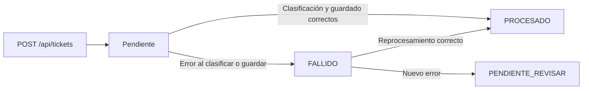
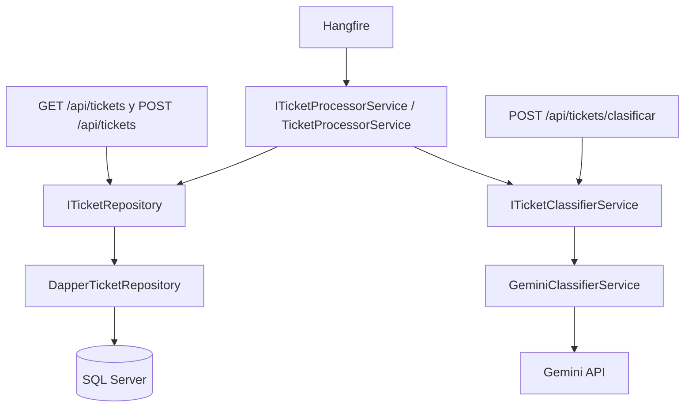

# Gestor de Tickets

API backend en C# y .NET 10 para registrar tickets de soporte y clasificarlos con Gemini.
Persiste los tickets en SQL Server y utiliza Hangfire para procesarlos en segundo plano, recuperar fallos y separar los casos que requieren revisión.

## Sobre el proyecto

El proyecto aborda la clasificación inicial de consultas técnicas y administrativas. La creación de un ticket no espera a la IA: guarda la solicitud y deja su clasificación a un proceso recurrente. El objetivo técnico es coordinar una API HTTP, persistencia SQL y un servicio externo, conservando un estado explícito cuando el procesamiento falla.

## Tech Stack

- **C# · .NET 10 · ASP.NET Core Minimal APIs** para el host y los endpoints.
- **SQL Server · T-SQL** para almacenar tickets y el estado de Hangfire.
- **Dapper · Microsoft.Data.SqlClient** para ejecutar SQL parametrizado y mapear resultados.
- **Hangfire 1.8.24** con almacenamiento en SQL Server para los trabajos recurrentes.
- **Gemini · Google.GenAI** para la clasificación de texto.
- **Inyección de dependencias · `ILogger<T>`** para componer servicios y registrar resultados y errores.

Las versiones de los paquetes están en [TicketProcessor.csproj](TicketProcessor.csproj). El repositorio no fija una versión del servidor SQL Server.

## Funcionalidades

- Crear tickets y consultar el listado, ordenado por ID descendente.
- Clasificar como `SOPORTE` (incidencias técnicas) u `OFICINA` (facturación, administración o envíos), en segundo plano o mediante una petición directa sin persistencia.
- Guardar categoría y fecha de procesamiento al completar un ticket; registrar fallos y recuperar los tickets en estado `FALLIDO`.
- Apartar los casos que vuelven a fallar mediante `PENDIENTE_REVISAR` y consultar los trabajos desde el dashboard de Hangfire.

## Flujo de procesamiento



Este flujo supone que las actualizaciones de estado se guardan correctamente. Cada lote se procesa secuencialmente. `POST /api/tickets/clasificar` realiza una clasificación directa y no participa en estas transiciones.

## Arquitectura

Un único proyecto ASP.NET Core con responsabilidades separadas mediante interfaces:



- [Program.cs](Program.cs) configura el host, CORS y Hangfire, y registra los tres servicios propios en DI con ciclo de vida `Transient`.
- [API/TicketEndpoints.cs](API/TicketEndpoints.cs) define las rutas y los contratos `TicketRequest` y `TicketCreacion`. El alta y la consulta acceden directamente al repositorio.
- [TicketProcessorService.cs](TicketProcessorService.cs) coordina la lectura de lotes, la clasificación y los cambios de estado; no contiene SQL.
- [Repositories/](Repositories/) contiene `ITicketRepository` y `DapperTicketRepository`, responsables de consultas, inserciones y actualizaciones.
- [GeminiClassifierService.cs](GeminiClassifierService.cs) adapta Gemini al contrato `ITicketClassifierService`, definido en [TicketClassifierService.cs](TicketClassifierService.cs). Este último conserva `DummyClassifierService`, que no está registrado ni actúa como alternativa automática si Gemini falla.
- [Ticket.cs](Ticket.cs) representa el ticket y [query.sql](query.sql) define su esquema inicial.

## Decisiones técnicas

- **Dapper:** mantiene visibles las consultas, los parámetros y las columnas que cambian en cada transición mediante SQL explícito.
- **Repository Pattern:** centraliza conexiones y operaciones sobre tickets. Los endpoints y el procesador dependen de `ITicketRepository`, sin repetir SQL ni conocer Dapper.
- **Hangfire:** separa el alta HTTP de la llamada a Gemini y conserva los trabajos en SQL Server. Los jobs buscan tickets por estado; el alta no crea un job individual por ticket.
- **Gestión de errores:** el clasificador normaliza la respuesta y solo acepta `SOPORTE` u `OFICINA`. Una respuesta inválida o un error del proveedor provoca una excepción, sin asignar una categoría por defecto. El procesador intenta guardar el estado de error y continuar con el siguiente ticket. Si falla la lectura del lote o el guardado del fallo, la excepción llega a Hangfire.
- **Revisión humana:** `PENDIENTE_REVISAR` detiene los intentos automáticos sobre los casos que vuelven a fallar. Es una señal para revisión: todavía no existe una interfaz ni un endpoint para resolverlos.

## Endpoints

Base local con el perfil `http`: `http://localhost:5282`.

### `GET /api/tickets`

Devuelve `200 OK` con un array, sin paginación. Incluye `id`, `clienteEmail`, `textoTicket`, `categoriaIA` y `estado`. Las propiedades `fechaCreacion` y `fechaRespuesta` se serializan como `null` porque la consulta no selecciona fechas.

```bash
curl http://localhost:5282/api/tickets
```

### `POST /api/tickets`

Inserta un ticket con estado `Pendiente`. No tiene validación explícita del correo ni del contenido en este endpoint.

```bash
curl -X POST http://localhost:5282/api/tickets \
  -H 'Content-Type: application/json' \
  -d '{"clienteEmail":"persona@example.com","textoTicket":"No puedo iniciar sesión; aparece un error 500."}'
```

Respuesta actual: `200 OK`, sin ID ni cabecera `Location`:

```json
{"mensaje":"Ticket encolado para Hangfire"}
```

El mensaje describe el procesamiento posterior: la operación únicamente inserta la fila que recogerá el job recurrente.

### `POST /api/tickets/clasificar`

Espera la respuesta de Gemini y devuelve la clasificación sin crear ni modificar un ticket.

```bash
curl -X POST http://localhost:5282/api/tickets/clasificar \
  -H 'Content-Type: application/json' \
  -d '{"textoTicket":"La factura de este mes ha llegado duplicada."}'
```

Devuelve `200 OK` con `ticketOriginal` y `clasificacion` (`OFICINA` o `SOPORTE`). Para texto nulo, vacío o en blanco devuelve `400 Bad Request` con `{"error":"El texto del ticket es obligatorio."}`. Los fallos de Gemini se propagan como errores del servidor, sin un contrato de error propio ni `ProblemDetails` configurado.

## Estados de ticket

- **`Pendiente`:** estado exacto al insertar, también predeterminado en SQL. Lo selecciona el job de pendientes.
- **`PROCESADO`:** clasificación y actualización completadas; guarda `CategoriaIA` y `FechaProcesamiento`. No vuelve a seleccionarse automáticamente.
- **`FALLIDO`:** error durante el procesamiento de un pendiente. Se limpian categoría y fecha de procesamiento; el job de fallidos lo recoge para otro intento.
- **`PENDIENTE_REVISAR`:** nuevo error al procesar un fallido. Queda sin categoría ni fecha de procesamiento y fuera de ambos jobs. No hay una operación de aplicación para devolverlo al flujo automático.

Los estados son texto, sin restricción SQL `CHECK`. No hay contador persistido de intentos ni garantía de una única ejecución por ticket.

## Ejecución local

### 1. Requisitos

SDK de **.NET 10**, Git, una instancia accesible de SQL Server y una clave de Gemini con acceso al modelo usado por el código. Los comandos siguientes utilizan Bash o zsh, `curl` y [sqlcmd](https://learn.microsoft.com/en-us/sql/tools/sqlcmd/sqlcmd-utility). El repositorio no incluye un contenedor de SQL Server.

### 2. Clonar y restaurar dependencias

```bash
git clone https://github.com/Dieveloper/GestorDeTickets.git
cd GestorDeTickets
dotnet restore
```

### 3. Inicializar la base de datos

Ejecuta [query.sql](query.sql): crea **`TicketProcessorDb`** y **`TicketsSoporte`**, sin datos de prueba. Sustituye el servidor y `usuario_sql` por los de tu entorno; `sqlcmd` solicitará la contraseña:

```bash
sqlcmd -S localhost,1433 -U usuario_sql -d master -C -b -i query.sql
```

Necesitas permisos para crear la base y la tabla. El script **no es idempotente**: falla si esos objetos ya existen. Hangfire crea sus propias estructuras al arrancar; la conexión de la aplicación necesita permisos sobre los tickets y para inicializar el esquema de Hangfire. [Almacenamiento SQL de Hangfire](https://docs.hangfire.io/en/latest/configuration/using-sql-server.html).

### 4. Configurar y arrancar

Define las dos variables de la siguiente sección y, en esa misma terminal, ejecuta:

```bash
dotnet run --launch-profile http
```

La API escucha en `http://localhost:5282`. Crea un ticket con el ejemplo anterior y consulta el listado tras la ejecución del job. El resultado depende de la disponibilidad de SQL Server y Gemini.

## Configuración y secretos

- **`ConnectionStrings:BdConexion`** → variable de entorno **`ConnectionStrings__BdConexion`**. La usan el repositorio y Hangfire.
- **`GeminiApiKey`** → variable de entorno **`GeminiApiKey`**. La consume `GeminiClassifierService`.

Formato de conexión con valores ficticios:

```text
Server=localhost,1433;Database=TicketProcessorDb;User Id=usuario_sql;Password=<contraseña>;Encrypt=True;TrustServerCertificate=True
```

`TrustServerCertificate=True` y `-C` son para desarrollo local con certificados no confiables. En un despliegue, utiliza un certificado validable.

Para introducir los valores sin escribirlos en el historial de comandos, ejecuta **cada bloque por separado**, pega el valor cuando la terminal espere y pulsa Enter. La entrada permanece oculta:

```bash
read -r -s ConnectionStrings__BdConexion
```

```bash
read -r -s GeminiApiKey
```

Después expórtalos para que `dotnet run` los reciba:

```bash
export ConnectionStrings__BdConexion GeminiApiKey
```

No hay un `UserSecretsId` configurado ni una plantilla de `appsettings.json` versionada. `appsettings.json` y `appsettings.Development.json` están ignorados por Git; guardar credenciales ahí sigue siendo almacenamiento en texto plano. Las variables permiten ejecutar el proyecto sin crear esos archivos. Comprueba que cualquier configuración local previa apunte a `TicketProcessorDb`.

El modelo está fijado en la constante `ModelName` de `GeminiClassifierService`: **`gemini-3.6-flash`**. No se puede cambiar desde configuración; su disponibilidad para la cuenta debe comprobarse al ejecutar la integración.

## Hangfire

Los trabajos se registran en [Program.cs](Program.cs):

- **`ProcesarTickets`**: cada minuto (`Cron.Minutely()`), ejecuta `ProcesarTicketsPendientesAsync()` sobre `Pendiente`.
- **`ReprocesarTicketsFallidos`**: cada cinco minutos (`*/5 * * * *`), ejecuta `ProcesarTicketsFallidosAsync()` sobre `FALLIDO`. Cuenta la siguiente ejecución programada, no cinco minutos desde cada fallo.

El servidor Hangfire comparte proceso y cadena de conexión con la API. La aplicación debe permanecer en ejecución para procesar los trabajos. [Trabajos recurrentes de Hangfire](https://docs.hangfire.io/en/latest/background-methods/performing-recurrent-tasks.html).

La recuperación por estado es distinta del reintento de un job: si el procesador guarda el estado de error, captura la excepción y el job puede terminar correctamente. Las excepciones que sí llegan a Hangfire usan su política predeterminada de reintentos, sin personalización en este repositorio. [Gestión de excepciones de Hangfire](https://docs.hangfire.io/en/latest/background-processing/dealing-with-exceptions.html).

Dashboard: **http://localhost:5282/hangfire**. Está habilitado en todos los entornos y conserva el acceso local predeterminado de Hangfire. **Antes de exponerlo en producción, configura autenticación y autorización explícitas y revisa el acceso a través de proxies**: el proyecto no incorpora esa protección. [Autorización del dashboard](https://docs.hangfire.io/en/latest/configuration/using-dashboard.html).

## Limitaciones actuales

- La API no tiene autenticación y CORS permite cualquier origen, cabecera y método.
- Los lotes no reclaman tickets de forma atómica; ejecuciones solapadas pueden clasificar el mismo ticket. No hay paginación de lotes ni control propio de cuotas de Gemini.
- SQL guarda `FechaProcesamiento`, pero el modelo declara `FechaRespuesta`; el listado tampoco recupera `FechaCreacion`. Las fechas no se exponen correctamente en la API actual.
- Gemini registra modelo, categoría o tipo de error con `ILogger`. El procesador registra la excepción completa: no se garantiza que todos los logs estén libres de datos sensibles.
- No hay proyectos de tests en el repositorio. `TicketProcessor.http` conserva una petición a `/weatherforecast/`, que no existe; utiliza los ejemplos de este README. `revision-ticketprocessor.html` es una revisión anterior con observaciones desactualizadas.
- `Microsoft.AspNetCore.OpenApi` está referenciado, pero no se registra ni expone un documento OpenAPI.

## Roadmap

- [x] API de creación y listado con persistencia SQL mediante repositorio.
- [x] Clasificación con Gemini y procesamiento recurrente con Hangfire.
- [x] Recuperación de fallidos y separación de casos para revisión.
- [ ] Validar los DTOs de entrada y unificar errores con `ProblemDetails`.
- [ ] Añadir consulta por ID, devolver `201 Created` al crear y corregir el mapeo de fechas.
- [ ] Incorporar una operación de revisión humana y control de concurrencia e idempotencia.
- [ ] Añadir tests unitarios del procesamiento y pruebas de integración de API y SQL.
- [ ] Habilitar OpenAPI y actualizar el archivo de peticiones HTTP.
- [ ] Preparar el despliegue: autenticación, dashboard protegido, CORS restringido y configuración externa del modelo.

## Qué demuestra este proyecto

Este proyecto permite practicar y demostrar desarrollo backend con ASP.NET Core, SQL parametrizado con Dapper, separación de responsabilidades mediante interfaces e inyección de dependencias, integración con servicios externos y procesamiento en segundo plano. El flujo de fallos muestra cómo conservar el estado de una operación, recuperarla y apartarla cuando necesita intervención.
